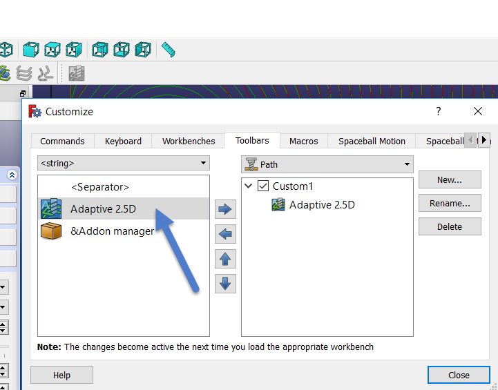

# FreeCAD Add-on - Adaptive Path Operation

## Description
Adaptive Path Operation - add-on to Path workbench that generates toolpaths while keeping the constant material removal rate throughout the cut

## Installation
1. Prerequisite - install the pyclipper library into the FreeCAD's python environment
    ```bash
        pip install pyclipper
    ````
    to check the installation you may run the following in the FreeCAD python console:

    

    if it does not raise error, FreeCAD prerequisites should be ok

2. Clone the FreeCAD_Mod_Adaptive_Path source into to ~/.FreeCAD/Mod/FreeCAD_Mod_Adaptive_Path
3. Start the FreeCAD and add the command to the toolbar - the "Adaptive Path" command will not automatically appear in the toolbar, you need to add it by customizing the Path toolbar

    

4. You are ready to go

## Usage
The usage of the Adaptive Path Operation similar to other Path operations. You may select faces and cut inside of the edges of selected face or outside (within the stock boundary). You also may select vertical faces to define cut region. By using the "Precision vs Performance" slider you may lower the time needed to compute the tool-paths (i.e. in cases where the accuracy is not very critical) or increase the accuracy when needed. By using the "Helix max diameter" you may decrease the helix (plunge) diameter in the narrow areas. "Lift distance" defines distance by which to raise the tool in the repositioning (G0) moves when there are no obstacles in between (if there are obstacles the tool is raised to Safe Height). "Step Over" and "Step Down" define the material removal rate that will algorithm will try to keep constant during the whole cut.

## A few screenshots

  

  


